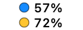
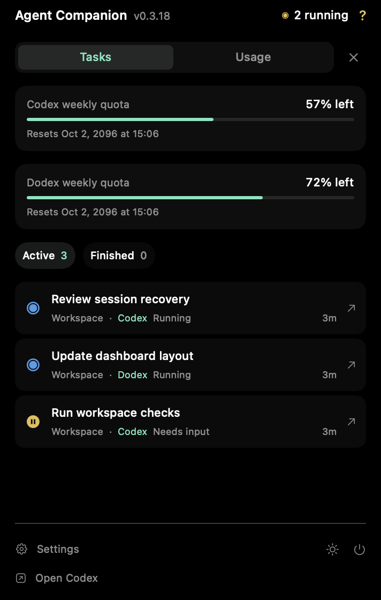
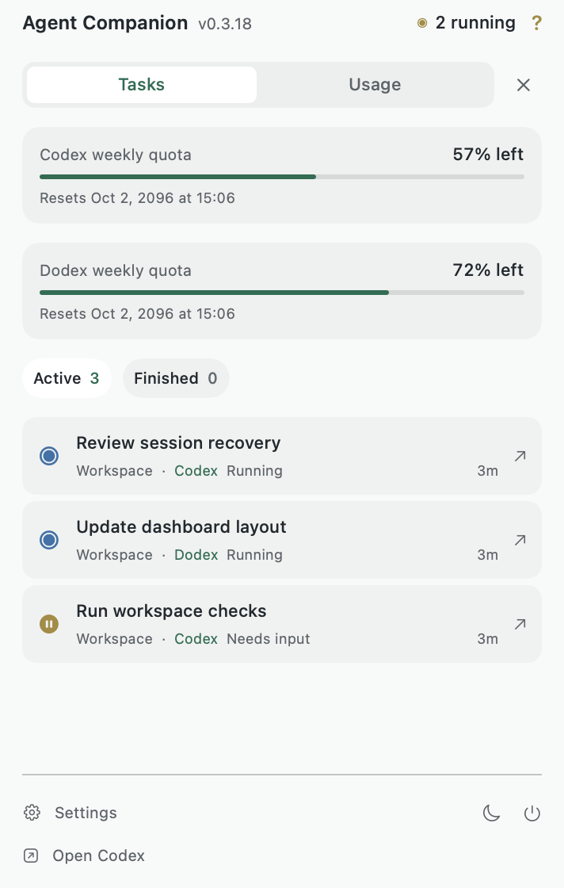

# Agent Companion

[中文](#中文) · [English](#english) · [截图 / Screenshots](#截图--screenshots) · [下载 / Downloads](https://github.com/WXGopher/agent-companion/releases/latest)

## 中文

在 Windows 任务栏或 macOS 菜单栏查看 Codex 的任务状态与订阅用量。

### v0.3.19 更新

- 修复已审计旧版 Dodex 的桌面启动链路：明确使用独立目录，TUI 运行时也能启动桌面 App。
- 增加桌面校验／修复命令，兼容标准 Finder 自定义图标，保留官方程序的签名检查。
- 源码仓库提供可选的入口整理、CLI 环境隔离和 Dock 清理工具；升级 App 不会自动执行迁移。[发布说明](docs/releases/v0.3.19.md)

### 主要功能

- **任务状态**：查看运行中、待处理和已结束的任务，点击返回对应对话或终端。
- **Tasks / Usage**：切换任务与用量，查看剩余额度、重置时间、累计 Token 和最近七个有记录日期的用量柱状图。
- **状态栏定制**：选择 Codex CLI 状态栏组件，实时预览并保存。
- **Windows 集成**：任务栏分别显示 Codex（`C`）和 Dodex（`D`）的每周剩余额度；支持任务完成通知、开机启动，以及可选的工具审批和提问卡片。
- **macOS 入口**：菜单栏显示每周剩余额度，Codex 在上、Dodex 在下；有历史读数的实例在闲置时继续显示，待更新的数值带 `*`，悬停可查看说明。尚无读数时显示 `—` 和对应任务状态；点击弹出任务／用量面板。macOS 仅保留菜单栏入口，设置从弹出面板底部打开。
- **任务状态标记**：分别显示 Codex／Dodex 状态：蓝色呼吸表示进行中，黄色表示待确认／待输入或失败，绿色仅表示所有任务均完成，灰色表示无任务或停止、暂停、未知等状态。混合任务优先显示等待，其次显示运行；失败不会误报为完成。macOS 菜单栏与 Windows 任务栏使用相同颜色含义，Windows 保留现有图标形状。
- **macOS 面板**：顶部显示 Agent Companion、当前版本和正在运行的任务数。点击底部的太阳／月亮按钮切换亮色／暗色主题，Tasks 和 Usage 同步更新；重启后保留主题选择，默认使用暗色。
- **可选 Codex 双开（Windows / macOS）**：在设置中手动部署或接入 Dodex，任务标注来源，用量、缓存和 CLI 状态栏设置按实例管理。默认关闭，不自动接入或启动 Dodex。
- **配置与个人指令同步**：双开页签显示双方文件路径，提供独立的 Codex → Dodex、Dodex → Codex 操作，手动覆盖 `config.toml` 或各自 `CODEX_HOME` 下的全局 `AGENTS.md`，覆盖前备份目标。配置可能含有内嵌密钥，同步时会一并复制；**不复制 `auth.json`**，保留目标实例的登录存储、数据库和日志设置。没有自动同步，详见[同步说明](docs/macos-dual-instance.md#manual-configuration-and-instruction-sync)。

订阅用量复用对应实例的 Codex CLI ChatGPT 登录，无需 API Key。两个平台的 Usage 查询结果均按实例缓存 5 分钟，从查询完成时计时；切换页面直接复用有效缓存，手动刷新可立即重新查询。已过重置时间的额度不会继续显示为有效值。

macOS 即使关闭面板，也会按实例每 5 分钟刷新账号用量。缓存到期、读取失败或额度重置后，最后已知数值以 `*` 标记为待更新。例如 `69%*` 表示上次有效读数为剩余 69%，正在等待新的有效结果；刷新取得有效读数后显示最新百分比并去掉星号。不会把重置后的额度推算为 100%。后台和用量页共享查询与缓存，不启动模型任务。

### 安装

**Windows x86_64**

1. 安装 [Microsoft Visual C++ x64 运行库](https://aka.ms/vc14/vc_redist.x64.exe)。
2. 从[最新版本](https://github.com/WXGopher/agent-companion/releases/latest)下载以 `windows-x86_64.zip` 结尾的压缩包，解压后双击 `agent-companion.exe`。
3. 如需工具审批，在解压目录打开 PowerShell，安装 Codex hooks：

```powershell
.\agent-companion.exe setup install codex
```

随后在 Codex 中用 `/hooks` 审阅并信任配置，再开启新会话。如需提问卡片及精确终端跳转，使用同目录的 `agent-companion-codex.exe` 启动 Codex。

**Windows 双开**：右键任务栏读数或托盘图标 → **Settings… → Codex 双开 → 启用 Dodex 支持**，也可点击 **部署双开环境 / 检查并接入**。需要本机已安装且签名有效的官方 Microsoft Store Codex / ChatGPT 应用。启用时先检查已有环境，缺少时自动部署，并配置 shell 的 `dodex` 命令；重复操作会校验环境、补齐命令，不覆盖已有账号和个人配置。在 PowerShell、cmd 或 Git Bash 中运行 `dodex`，会在当前终端和工作目录打开使用第二份配置的 Codex CLI；首次使用时自行登录第二个账号：

```powershell
dodex
dodex --help
dodex resume
dodex exec "检查当前项目"
dodex -C C:\projects\demo
```

普通参数直接传给 Codex CLI，`--help` 和 `--version` 也由 Codex 处理。仅以 `--check` 或 `--deploy` 开头时进入环境管理：`dodex --check` 只检查官方运行程序；`dodex --deploy` 部署或校验环境并修复 shell 支持。升级旧版命令时，从新版程序运行 `.\agent-companion.exe dodex --deploy`。独立环境位于 `%LOCALAPPDATA%\AgentCompanion\Dodex`，已有账号、会话和个人配置继续使用。

桌面版仍可通过任务栏或托盘菜单的 **打开 Dodex**，或 `.\agent-companion.exe dodex` 打开，使用同一份第二实例配置。

命令优先放入当前 PATH 已包含的用户命令目录，现有终端即可发现；Git Bash 如缓存了旧命令，可运行 `hash -r`。若需要新增 PATH 目录，设置会提示完全退出并重开终端。已有无关的同名命令不会被覆盖，设置会指出冲突路径。

**macOS 14+ · Apple Silicon**

1. 从[最新版本](https://github.com/WXGopher/agent-companion/releases/latest)下载以 `macos-arm64.zip` 结尾的压缩包。
2. 解压，将 `Agent Companion.app` 拖到“应用程序”并打开。

应用尚未经过 Apple 公证；首次打开若被拦截，可按 [Apple 官方说明](https://support.apple.com/102445)在“系统设置 → 隐私与安全性”中选择“仍要打开”。

**macOS 双开**：设置 → Codex 双开 → 部署双开环境。需要本机已安装且签名有效的官方 Codex.app。完成后在“应用程序”中打开 Dodex 并登录。

macOS 重新打开 Agent Companion 会显示弹窗的 Tasks 页。刘海、悬停展开、显示器选择与独立 Dock 入口已移除；旧版入口偏好不会隐藏菜单栏，已保存的菜单栏位置继续保留。设置从弹窗底部打开。详见[菜单栏说明](docs/MACOS_MENU_BAR.md)。

**双开隔离与停用**：两个平台的新环境均使用独立文件凭证、历史、数据库和个人配置，不复制原实例的账号数据。已有环境只有通过兼容性和隔离校验才会接入，冲突时停止且不覆盖。停用只关闭 Companion 对第二实例的监控，不退出 Dodex、不删除环境。暂不提供双开运行程序的自动更新或卸载。

**升级**：先退出旧程序及设置窗口，再替换文件；已安装 Windows hooks 的用户需重新执行安装命令。Codex 配置、账号和双开环境会保留。

## English

See Codex tasks and subscription usage in the Windows taskbar or macOS menu bar.

### New in v0.3.19

- Repair the audited legacy Dodex desktop launch path: bind its independent directories and allow desktop startup while the TUI runs.
- Add desktop validation / repair commands and standard Finder custom-icon compatibility while retaining official signature checks.
- Provide optional source-checkout tools for entry consolidation, CLI environment isolation and Dock cleanup. Upgrading the App does not run these migrations automatically. [Release notes](docs/releases/v0.3.19.md)

### Features

- **Tasks**: track running, waiting and finished tasks, then jump back to the conversation or terminal.
- **Tasks / Usage**: switch to remaining quota, reset times, lifetime tokens and a bar chart of the last seven reported days.
- **Status bar editor**: choose Codex CLI components with a live preview.
- **Windows integration**: separate taskbar readings for Codex (`C`) and Dodex (`D`) weekly quota remaining, completion notifications, startup settings, and optional tool approvals and question cards.
- **macOS menu bar**: the menu bar shows weekly quota remaining, with Codex above Dodex. Instances with a previous reading stay visible while idle; readings awaiting an update carry `*`, with an explanation on hover. Before a reading is available, its row shows `—` and the task status; click it for tasks and usage. The menu bar is the only macOS entry; open Settings from the popup footer.
- **Task status marks**: Codex / Dodex each show breathing blue for running tasks, yellow for approval/input or failure, green only when every task completed, and gray for no tasks, stopped, paused or unknown states. Waiting takes priority over running in mixed groups; failures never count as successful completion. The macOS menu bar and Windows taskbar use the same colors; Windows keeps its existing icon shapes.
- **macOS panel**: the header shows Agent Companion, its current version and the number of running tasks. Use the sun / moon button at the bottom to switch light / dark themes across Tasks and Usage. Your theme choice is saved across restarts; dark is the default.
- **Optional second Codex instance (Windows / macOS)**: explicitly deploy or connect Dodex in Settings. Tasks show their source; usage, caches and CLI status bar settings stay separate. Disabled by default, with no automatic adoption or launch.
- **Configuration and personal instructions**: the dual-instance tab shows both file paths and separate Codex → Dodex / Dodex → Codex actions for manually overwriting `config.toml` or the global `AGENTS.md` in each `CODEX_HOME`, with destination backups. Config files may contain embedded secrets, which are copied; **`auth.json` is never copied**, and the destination's account storage, database and log settings remain independent. Sync is never automatic. See [sync behavior](docs/macos-dual-instance.md#manual-configuration-and-instruction-sync).

Subscription usage uses each instance's Codex CLI ChatGPT login. No API key is needed. Both platforms cache Usage results separately for five minutes from completion; switching pages reuses a fresh result, while manual refresh reads again. Quota readings past their reset time are no longer treated as valid.

On macOS, account usage refreshes every five minutes per instance even with the panel closed. After cache expiry, a failed read or a quota reset, the last known reading carries `*`. For example, `69%*` means the cached last reading was 69% remaining and a valid update is pending. Once refresh obtains a valid reading, the latest percentage appears without the star. The app never infers 100% remaining after a reset. Background refresh and the Usage page share requests and caches without starting model tasks.

### Install

**Windows x86_64**

1. Install the [Microsoft Visual C++ x64 Redistributable](https://aka.ms/vc14/vc_redist.x64.exe).
2. Download the archive ending in `windows-x86_64.zip` from the [latest release](https://github.com/WXGopher/agent-companion/releases/latest), extract it, and open `agent-companion.exe`.
3. For tool approvals, open PowerShell in the extracted folder and install Codex hooks:

```powershell
.\agent-companion.exe setup install codex
```

Use `/hooks` in Codex to review and trust the configuration, then start a new session. For question cards and precise terminal navigation, launch Codex through `agent-companion-codex.exe` in the same folder.

**Windows second instance**: right-click the taskbar readout or tray icon → **Settings… → Codex 双开 → 启用 Dodex 支持**, or click **部署双开环境 / 检查并接入**. Requires the locally installed, validly signed official Microsoft Store Codex / ChatGPT app. Enabling checks an existing environment, deploys one if missing, and registers the `dodex` shell command. Repeating this validates the deployment and repairs shell support without overwriting existing account data or personal settings. In PowerShell, cmd or Git Bash, `dodex` opens Codex CLI in the current terminal and working directory using the second profile. Sign in with a second account on first use:

```powershell
dodex
dodex --help
dodex resume
dodex exec "Inspect this project"
dodex -C C:\projects\demo
```

Regular arguments pass directly to Codex CLI, including `--help` and `--version`. Only a leading `--check` or `--deploy` selects deployment management: `dodex --check` checks the official runtime; `dodex --deploy` deploys or validates the environment and repairs shell support. To upgrade an older command, run `.\agent-companion.exe dodex --deploy` from the new release. The isolated environment lives under `%LOCALAPPDATA%\AgentCompanion\Dodex`; existing account data, sessions and personal settings stay in use.

For the desktop app, choose **打开 Dodex** from the taskbar or tray menu, or run `.\agent-companion.exe dodex`. It uses the same second-instance profile.

The command is installed in a supported user command directory already on the current PATH when possible, so existing terminals can find it. Run `hash -r` in Git Bash if it cached an older command. If a new PATH entry is needed, Settings asks you to fully quit and reopen the terminal. Unrelated commands with the same name are preserved, and Settings reports the conflicting path.

**macOS 14+ · Apple Silicon**

1. Download the archive ending in `macos-arm64.zip` from the [latest release](https://github.com/WXGopher/agent-companion/releases/latest).
2. Extract it, drag `Agent Companion.app` into Applications, and open it.

The app is not Apple-notarized. If the first launch is blocked, follow [Apple's instructions](https://support.apple.com/102445) to choose **Open Anyway** in System Settings → Privacy & Security.

**macOS second instance**: Settings → Codex 双开 → 部署双开环境. Requires a locally installed, validly signed official Codex.app. After deployment, open Dodex from Applications and sign in.

On macOS, reopening Agent Companion shows the popup's Tasks page. The notch, hover expansion, display selection and separate Dock entry have been removed. Legacy entry preferences cannot hide the menu bar, and its saved position is retained. Open Settings from the popup footer. See the [menu-bar guide](docs/MACOS_MENU_BAR.md).

**Isolation and disabling**: on both platforms, a fresh environment has separate file credentials, history, databases and personal settings, without copying account data from the original instance. Existing environments are adopted only after compatibility and isolation checks; conflicts stop without overwriting. Disabling integration stops Companion monitoring the second instance without quitting Dodex or deleting its environment. Automatic runtime updates and uninstall are not included.

**Upgrade**: quit the old app and its Settings window, then replace the files. If you installed Windows hooks, rerun the installation command. Codex configuration, accounts and the second-instance environment are retained.

## 截图 / Screenshots

界面使用演示数据。 / Screenshots use sample data.

### Windows

<p align="center">
  
  
</p>

<details>
<summary>设置 / Settings</summary>

<p align="center"></p>

<p align="center"></p>

</details>

### macOS

<p align="center"></p>
<p align="center">
  
  
</p>

<details>
<summary>设置 / Settings</summary>

<p align="center"></p>

</details>

---

[GPL-3.0-only](LICENSE) · [Third-party notices](THIRD_PARTY_NOTICES.md)
