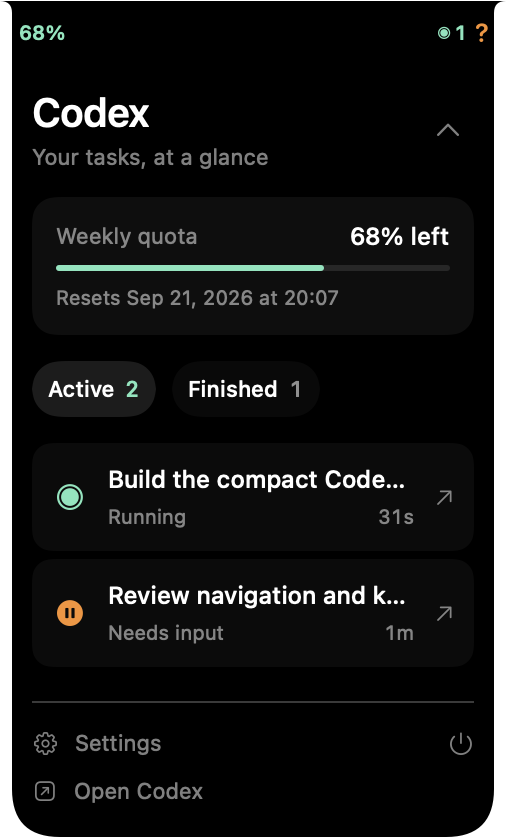
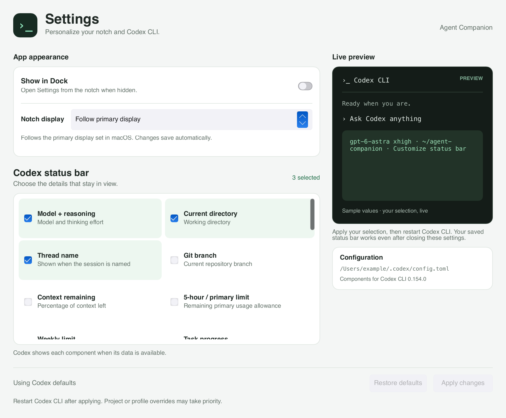
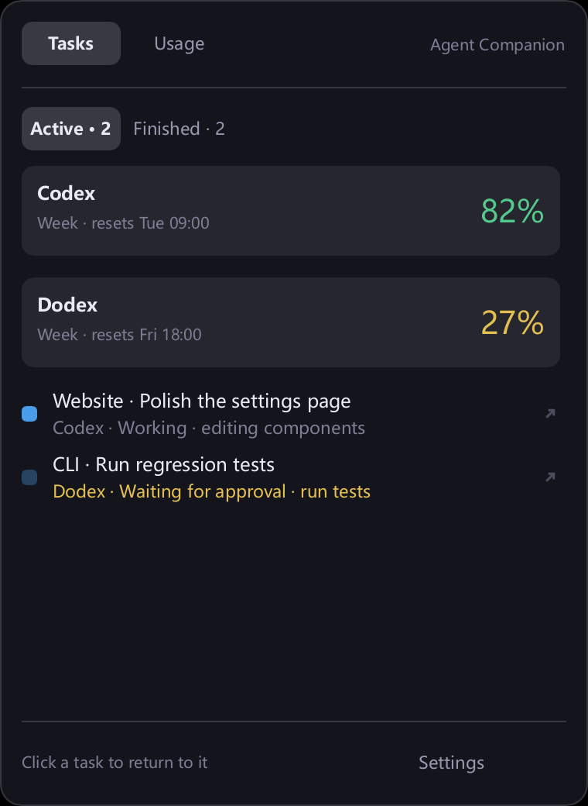
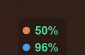
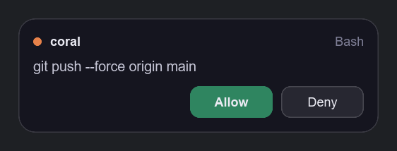
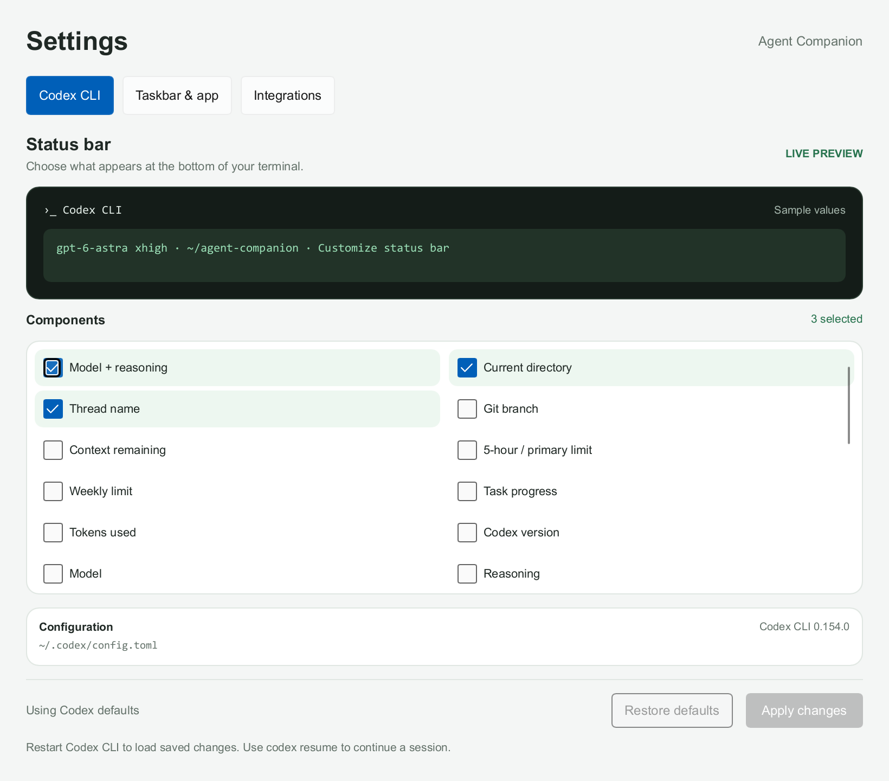

# Agent Companion

[中文](#中文) · [English](#english)

<p align="center">
  <a href="https://github.com/WXGopher/agent-companion/actions/workflows/ci.yml"></a>
  <a href="https://github.com/WXGopher/agent-companion/releases/latest"></a>
  
  <a href="LICENSE"></a>
</p>

**下载 / Download v0.3.9:** [macOS Apple Silicon](https://github.com/WXGopher/agent-companion/releases/download/v0.3.9/agent-companion-v0.3.9-macos-arm64.zip) · [Windows x86_64](https://github.com/WXGopher/agent-companion/releases/download/v0.3.9/agent-companion-v0.3.9-windows-x86_64.zip) · [发布说明 / Release notes](https://github.com/WXGopher/agent-companion/releases/tag/v0.3.9)

## 中文

**Windows + macOS Apple Silicon。** Agent Companion（原 Atoll）在 Windows 任务栏和 macOS 窄刘海显示 Codex 任务与额度。展开刘海即可进入设置，定制 Codex CLI 状态栏；也可单独打开编辑器。

| 平台 | 本版功能 | 启动方式 |
| --- | --- | --- |
| Windows x86_64 | 原有任务栏、会话、审批、通知、启动器，以及状态栏编辑器 | `agent-companion.exe`；独立编辑器用 `agent-companion.exe codex-tui` |
| macOS 14+ Apple Silicon | Codex 窄刘海、任务列表与跳转、内置 TUI 设置入口 | 双击 `Agent Companion.app`；独立编辑器用 `agent-companion codex-tui` |

### macOS 窄刘海

- 左侧只显示**周剩余额度**，例如 `68%`，省略 `left`；右侧绿色图标和数字表示**正在工作的会话数**。有待审批或待输入的会话时显示一个橙色 `?`，这些会话不计入工作数。没有工作时显示灰色 `0`；剩余额度不超过 10% 时变为橙色，缺失或过期时显示 `—`。展开后可查看需要处理的会话和最近十五分钟结束的任务，额度卡片保留 `left` 说明。
- 鼠标移到刘海附近约 0.18 秒即自动展开，无需点击，也不抢键盘焦点；判定包含屏幕最顶边，并在可见窄条左右各留 12 点、下方留 8 点容错，显示宽度不变；实体刘海两侧的菜单图标区域不触发展开。移开约 0.35 秒后收起。点击后保持展开，按 Esc 或点击外部收起。展开默认显示活动任务，可切换 Finished 查看完成、停止和失败的任务。开发版 v0.3.10 中，Active / Finished 共用稳定的列表区域，切换时面板和底部按钮保持原位；切换后从列表顶部开始，同一标签的数据刷新保留滚动位置。
- 点击任务返回对应 Codex 桌面对话。CLI 根据存活进程定位 Terminal/iTerm2 的原标签页；首次可能需要在系统 Automation 设置中授权。其他终端尽力唤起宿主应用，定位失败时可复制 `codex resume` 命令。
- 刘海默认跟随 macOS 设置的**主显示器**。在 **Settings → Notch display** 中，可选择 **Follow primary display（跟随主显示器）**，或指定任意已连接的显示器；立即生效并自动保存，无需点击 Apply。指定屏断开时临时回到主屏，重新连接后自动返回指定屏；更换主屏不会覆盖指定选择。MacBook 上剩余额度位于摄像头左侧、工作数及待处理问号位于右侧，与菜单栏图标同一行；中央完整避开实体摄像头，左右按各自内容单独取最小宽度，为菜单图标留出空间。普通显示器最大为 216 × 28 点，小屏自动收窄至 180 点。每次切屏重新计算尺寸，居中贴住屏幕顶边，展开时保持顶边和宽度不变。支持不同桌面空间。
- 刘海从原位置平滑向下延展，顶部计数与额度始终留在原位，展开保持同宽；移开后平滑回缩，途中再次进入会接着当前形状展开。系统开启“减少动态效果”时直接切换。MacBook 收起高度与摄像头所在的菜单栏区域一致，数字不会落到菜单栏下方。
- 长错误提示和任务内容可滚动，展开高度限制在屏幕与底部 Dock 之间，设置和退出按钮保持可见。滚动或打开右键菜单时数据继续刷新，刷新不重置正文滚动位置；点击窄条中间的空白处也能展开。
- **Settings（设置）** 打开 TUI 定制窗口：macOS 风格开关、卡片分组和跟随系统的浅色／深色外观；开发版按 **Codex CLI** 和 **Notch & app** 分区：Codex 页顶部为横向长条实时预览，下方选择组件，底部 **Apply changes** 保存；显示器和 Dock 选项位于 Notch & app。切换分区保留未保存的组件选择。再次点击会回到已打开的设置；电源按钮或右键菜单退出刘海。刘海需要运行才能更新任务，保存后的 CLI 状态栏配置无需常驻。
- 默认不显示 Dock 图标，打开设置也不会额外占位。需要时可在设置中开启 **Show in Dock**，立即生效并记住选择；此开关自动保存，不需要点击 TUI 的 Apply。

开发版的 **Usage** 页面显示 Codex 订阅的额度窗口、重置时间、累计 Token、单日峰值、最近七个有记录日期的用量、连续使用天数及最长任务时间。顶部固定显示 **Tasks / Usage**，随时一键切回任务；也可点击周额度卡片进入用量，宽度不变。展开字体和间距缩小，大号 Token 数字调至约 13.5 pt。复用 Codex 的 ChatGPT 登录，无需 API Key。仅在用量页按需读取，五分钟内切换页面复用缓存，页面打开期间每五分钟自动刷新，也可手动刷新。查询不启动模型推理，不产生推理 Token 消耗。没有数据时显示 `—`；Token 总数与订阅剩余额度是不同指标，服务端数据可能延迟，也不提供账号级输入／缓存／输出拆分。详见[订阅用量说明](docs/MACOS_NOTCH.md#订阅用量开发中未发布)。

任务状态与默认周额度来自本地 Codex 会话和分页历史；开发版菜单栏额度在启动时读取，之后每 **2 分钟**检查本地记录。任务刷新和 Usage 页的五分钟联网刷新保持各自间隔，订阅用量通过 Codex 官方账号读取接口获取，不发起模型请求。macOS 不启动 hooks、审批服务或其他代理，不包含宠物、主题编辑或 Intel Mac 支持。

<p align="center"></p>

<p align="center"></p>

以上为开发中的刘海与设置布局（尚未发布）。组件只显示一行名称，悬停查看说明。[查看刘海与应用分区](docs/macos-app-settings.png) · [查看订阅用量](docs/macos-subscription-usage.png)（合成数据）。

### macOS 安装

下载上方 **macOS Apple Silicon** 压缩包，解压并将 **Agent Companion.app** 拖到“应用程序”。需要 macOS 14 或更新版本。本版没有 Developer ID 签名或 Apple 公证。首次打开若被系统拦截，按 [Apple 官方步骤](https://support.apple.com/en-us/102445)，在“系统设置 → 隐私与安全性”中选择“仍要打开”。

**从旧版本升级：** 先退出旧刘海及设置窗口，再替换“应用程序”中的 app 并重新打开。已有 Codex 配置继续保留。v0.2.x 默认打开编辑器；从 v0.3.0 起默认打开刘海，编辑器移到展开后的 **Settings**。macOS 暂无自动更新或开机启动设置。

在终端可直接运行 `"/Applications/Agent Companion.app/Contents/MacOS/agent-companion" codex-tui`。窗口显示本次实际配置路径，读取进程的 `CODEX_HOME`，缺省为 `~/.codex/config.toml`。Finder 启动不读取 shell 初始化脚本；若只在 shell 中设置了 `CODEX_HOME`，请从该终端启动应用。

**保存后无需常驻。** 状态栏由 Codex 自己显示；关闭编辑器后重新启动 Codex CLI 即可加载。以下任务栏、hooks、通知和启动器说明仅适用于 Windows。

**在 Windows 任务栏查看 Codex 的剩余额度与会话状态，处理工具审批和提问，返回对应桌面对话或终端分屏。**

Agent Companion 以 Codex 为支持和验证对象，通过 hooks、本地会话日志及可选 app-server 接入跟踪活动。Claude Code 兼容代码保留为实验性，未在真实环境验证，新配置默认关闭其显示。平时只在任务栏显示简洁的额度与状态，需要时展开详情或审批卡片。

<p align="center">
  
</p>

### 功能

- **任务栏额度与状态**：显示每个代理最紧张的额度窗口，以及等待处理、运行中、已完成的会话数量。颜色阈值可在设置中调整；仅等待或运行状态需要动画。
- **按活动显示代理**：启动时恢复上次保存的代理显隐和会话文本；Codex 本地额度独立刷新，不改变代理显隐。收到 Claude hook 或新的 Codex 日志事件后更新，并隐藏连续十五分钟没有活动的代理；再次活动时自动显示。点击详情不会触发额度请求。
- **详情面板自动收起**：点击任务栏控件或托盘图标展开；点击桌面、其他窗口，或切换到其他窗口后自动收起。再次点击 Agent Companion 图标也能关闭。
- **悬停预览待办**：停留在任务栏控件上可预览等待处理的会话，不抢键盘焦点；移开后自动收起，点击可展开完整详情。
- **Codex 会话自动识别**：每两秒读取本地日志中的开始、完成和中断事件，支持从旧日志目录恢复的会话。启动时建立日志基线；检测到仍持有写入锁的运行会话时立即恢复跟踪。没有存活证据的会话在十五分钟无活动后移除。分页历史接入为实验性，补充识别无日志会话、失败、中断和归档；桌面原生提问仍需返回 Codex 作答。
- **Claude Code 审批卡片（实验性）**：允许或拒绝工具调用，回答 `AskUserQuestion`。已被你的权限设置允许的工具调用不会弹出审批卡片。
- **Codex 审批与终端信息**：可选安装 Codex hooks，在真实 `PermissionRequest` 上允许或拒绝工具调用，并记录终端来源用于跳转。普通 CLI 会话缺少 hooks 信息时，通过仍持有会话日志的进程寻找原终端；已识别的桌面会话使用官方链接打开对应 Codex 桌面对话。
- **后台完成通知**：观察到任务持续至少三十秒并完成后，发送静音 Windows 通知，弹出三秒后自动收起。不会补发历史完成、中断或短任务；正在查看详情或对应终端时也不提醒。设置中可关闭，Agent Companion 运行期间点击通知可返回会话或详情。
- **原生提问卡片**：通过 Agent Companion 启动的 Codex CLI 会话支持多题切换、完整选项说明、多行自由文本、密码遮罩和返回修改草稿。卡片与终端先答者生效，重复回复会被丢弃。
- **精确返回会话**：Agent Companion 启动时记录 Windows Terminal 标签页和分屏，即使藏在其他标签页后或正在滚动输出，也能返回原分屏；目标失效时回退原终端窗口。CLI 终端已关闭或无法定位时保留详情面板，不改为打开桌面 App。普通 CLI 的标签页和分屏定位仍依赖标题或可见文本。IDE 暂不纳入本轮支持。
- **设置与托盘**：支持开机启动、按代理显示或隐藏任务栏内容、修改颜色阈值。右键任务栏控件或托盘图标进入设置或退出。
- **Codex CLI 状态栏定制**：设置 → Codex TUI → Customize status bar，勾选组件实时预览，Apply 保存，Restore Codex defaults 恢复默认；支持全部隐藏。
- **任务栏集成**：跟随任务栏位置、自动隐藏和通知区域大小变化；嵌入失败时使用贴近任务栏的浮动显示。重复启动 Agent Companion 会替换旧实例。
- **额度读取**：Claude Code 使用其已有凭据读取额度，并尽量复用本机缓存；Codex 每 30 秒在后台读取本地 rollout 日志，按额度事件时间选择最新记录，避免旧会话覆盖新额度。请求受限时会退避重试。




当前已发布版本为 v0.3.9；v0.3.10 仍在开发中，包含订阅用量页、列表切换修复和精简后的分区设置，尚未发布。项目仍在早期开发，部分 Windows 截图来自较早版本，具体外观以当前程序为准。Codex CLI 提问接入与桌面分页历史读取为实验性功能，桌面原生问题仍在 Codex 中作答。用户已在双屏环境确认选择内置屏后位置正常；开发版增加 Active / Finished 反复切换的逐帧检查，覆盖空列表、长列表、滚动位置以及顶部和底部像素稳定性，保留既有刘海、双屏和设置回归。物理拔插、全屏和 Terminal.app 跳转仍未覆盖，详见[验证范围](docs/MACOS_NOTCH.md)。Windows 验证构建和自动测试，未在 macOS 上宣称桌面实测。

### 安装与使用

Windows 版本需要 [Microsoft Visual C++ v14 x64 运行库](https://aka.ms/vc14/vc_redist.x64.exe)。首次安装请先安装或更新此运行库；程序依赖 `VCRUNTIME140.dll`，ZIP 不包含运行库安装器。版本与系统要求见 [Microsoft 官方说明](https://learn.microsoft.com/en-us/cpp/windows/latest-supported-vc-redist)。

从 [GitHub Releases](https://github.com/WXGopher/agent-companion/releases) 下载最新 Windows x86_64 压缩包，解压后在该目录运行：

```powershell
.\agent-companion.exe setup install codex
.\agent-companion.exe
```

第一条命令会将 `agent-companion.exe`、`agent-companion-hook.exe` 和 `agent-companion-codex.exe` 复制到 `%LOCALAPPDATA%\AgentCompanion\bin` 并安装 Codex hooks。Codex 无需 hooks 即可读取本地会话和额度；安装后可检查 hooks：

```powershell
.\agent-companion.exe setup status codex
```

升级时先退出旧 Agent Companion，从新解压目录重新执行安装命令；会保留配置并更新受管理 hooks。若只需状态栏编辑器，直接运行 `agent-companion.exe codex-tui` 即可。

随后在 Codex 中运行 `/hooks` 审阅并信任新增配置，再开启新会话。Agent Companion 不会代替你完成信任审核。安装命令及审批协议已在 Codex CLI 0.154.0 的环境中验证；配置格式见 [Codex hooks 文档](https://learn.chatgpt.com/docs/hooks)。

在 Windows Terminal 中通过 Agent Companion 启动 Codex，即可启用提问卡片和精确分屏跳转：

```powershell
& "$env:LOCALAPPDATA\AgentCompanion\bin\agent-companion-codex.exe"
# 在指定目录启动，或恢复已有对话
& "$env:LOCALAPPDATA\AgentCompanion\bin\agent-companion-codex.exe" -C C:\github\agent-companion
& "$env:LOCALAPPDATA\AgentCompanion\bin\agent-companion-codex.exe" --resume <会话ID>
```

此入口使用上游实验性的 [Codex app-server](https://learn.chatgpt.com/docs/app-server) / WebSocket 接口。中转仅在本机监听，要求临时令牌；退出后清理后端及其子进程。Agent Companion 未运行时仍可在 Codex 终端作答。现有桌面会话、普通 `codex` 命令启动的会话仍在 Codex 中回答；当前原生问题协议支持单选和文本，暂无多选。桌面直达使用[官方会话链接](https://learn.chatgpt.com/docs/app/commands)，需安装并注册 Codex 桌面应用。

- 左键点击任务栏控件或托盘图标：展开或收起详情。
- 悬停任务栏控件：有待处理会话时预览待办，移开后收起。
- 点击详情以外的位置，或切换窗口：自动收起详情。
- 右键点击任务栏控件或托盘图标：打开设置或退出。
- 需要开机启动时，在设置中打开相应开关。

检查或移除 hooks（按需选择代理）：

```powershell
.\agent-companion.exe setup status claude
.\agent-companion.exe setup uninstall claude
.\agent-companion.exe setup status codex
.\agent-companion.exe setup uninstall codex
```

`agent-companion.exe headless` 可在终端输出收到的 hook 事件，用于排查集成问题。它只监视 hook 事件流，不显示窗口。

### 定制 Codex CLI 状态栏



macOS 可从展开刘海后的齿轮 **Settings（设置）** 定制 TUI 状态栏；Windows 可在设置的 **Codex TUI** 页打开。两平台也可运行 `agent-companion codex-tui`。勾选表示显示，取消勾选表示隐藏；预览使用示例数据，不会发起模型请求。组件与默认预览按本机 Codex CLI **0.154.0** 的 `/statusline` 核对，包含模型、推理强度、目录、Git、上下文、额度、token 和会话信息。实际终端会省略无数据的组件，并按终端宽度显示。

点击 **Apply** 写入 `$CODEX_HOME/config.toml`（默认 `~/.codex/config.toml`）的 `tui.status_line`。全部取消后保存空列表以隐藏状态栏。现有组件顺序保持不变，新增组件排在后面；同一次编辑中取消再勾选会恢复原位置。重启 Codex CLI 后加载配置，可用 `codex resume` 继续已有会话。项目、profile 和命令行覆盖配置可能优先于此用户配置。

**Restore Codex defaults** 会立即移除用户配置中的 `tui.status_line`，由 Codex 自己决定默认展示，不会写入固定的默认列表。打开编辑器和勾选不写文件；保存及恢复前备份，保留其他配置和注释，状态栏在外部被修改时提示关闭并重新打开编辑器。恢复操作仅针对状态栏组件，主题和其他 TUI 设置保持原样。配置格式见 [OpenAI Docs 配置示例](https://learn.chatgpt.com/docs/config-file/config-sample)。

### 改名与升级兼容

新安装使用 `%APPDATA%\AgentCompanion`（配置与显示快照）和 `%LOCALAPPDATA%\AgentCompanion`（缓存与程序）。缺少新文件时复制旧 `Atoll` 目录中的对应配置、快照及缓存；保留原文件，新文件优先。显式配置目录不触发默认目录迁移。

所有 `AGENT_COMPANION_*` 环境变量兼容对应 `ATOLL_*`，新变量优先（包括显式空值或 false）。重新安装会替换新旧受管理 hooks，不重复添加；卸载使用原 `atoll-install.json` 和 `_atollOriginalStatusLine` 恢复记录。默认管道仍为 `\\.\pipe\atoll`，并保留 Windows 登录启动、通知和协议标识，使旧 hook 与新主程序兼容。旧安装的程序文件不删除。

仓库通过重命名现有仓库迁移，Stars、Issues 等保留；旧地址自动重定向。不要新建同名旧仓库，否则会破坏重定向。见 [GitHub 仓库改名说明](https://docs.github.com/en/repositories/creating-and-managing-repositories/renaming-a-repository)。

### 配置与本地数据

Agent Companion 在现有 hooks 旁添加自己的配置，卸载时只移除自己添加的部分。默认不修改 Claude Code 的 `statusLine`。旧的 `--wrap-status-line` 兼容选项仍保留，但通常无需使用。

| 路径或设置 | 用途 |
| --- | --- |
| `~/.claude/settings.json` | 安装、检查或移除 Agent Companion 的 hooks |
| `~/.claude/.credentials.json` | 只读，用于请求 Claude Code 额度；不记录凭据 |
| `~/.claude/projects/**/*.jsonl` | 只读，用于会话标题 |
| `~/.codex/sessions/**/*.jsonl` | 只读，用于 Codex 会话状态与额度 |
| `~/.codex/hooks.json`、`config.toml` | 可选安装 Codex hooks、启用 hooks 功能；修改前备份并保留其他配置 |
| `~/.codex/atoll-install.json` | 记录安装前的 hooks 开关，用于卸载恢复；用户后续修改的值会保留 |
| `%LOCALAPPDATA%\AgentCompanion\bin` | hooks 使用的稳定安装路径，避免后续编译覆盖正在使用的程序 |
| `%APPDATA%\AgentCompanion\display.json` | 上次显示的代理、额度和会话文本；不保存审批连接或终端跳转目标 |

环境变量：

| 变量 | 用途 |
| --- | --- |
| `CODEX_HOME` | 为 Codex 会话跟踪和 hooks 安装指定 `.codex` 目录的替代位置 |
| `AGENT_COMPANION_PIPE_NAME` | 指定命名管道，适用于隔离开发实例 |
| `AGENT_COMPANION_CONFIG_DIR` | 指定配置目录 |
| `AGENT_COMPANION_SKIP_HOOKS=1` | 让 hook 程序直接退出，不连接 Agent Companion |

Agent Companion 未启动、忙碌或响应超时时，hooks 会让代理回到原终端继续询问。卸载 hooks 不会删除已安装的程序文件。

### 构建与验证

在 macOS 14+ Apple Silicon 上安装近期稳定版 Rust 和 Xcode Command Line Tools（包含 Swift 编译器）后运行：

```sh
cargo fmt --all --check
cargo clippy -p agent-companion -p agent-companion-core --all-targets --locked -- -D warnings
cargo test -p agent-companion -p agent-companion-core --locked
cargo test -p agent-companion-core --features server --locked
sh scripts/test-macos-ui.sh
cargo build -p agent-companion --bin agent-companion --release --locked
python3 scripts/package-macos.py --binary target/release/agent-companion
```

应用和校验和生成在 `dist/`；打包需要 Python 3.11+。CI 分别在 Windows x86_64 与 macOS arm64 上构建、Clippy、运行公共测试；管道和桌面集成仅在 Windows 上运行。

在 Windows 上安装近期稳定版 Rust 工具链后运行：

```powershell
cargo fmt --all --check
cargo clippy --workspace --all-targets -- -D warnings
cargo build --workspace
cargo test --workspace
cargo build --workspace --release
```

需要真实 Windows 桌面的窗口及显示恢复回归测试可单独运行：

```powershell
cargo test -p agent-companion native_slint_readout_stays_frameless -- --ignored --nocapture
cargo test -p agent-companion --test display_lifecycle -- --ignored --nocapture
```

已安装 Agent Companion 且系统允许通知时，可执行 `cargo test -p agent-companion native_completion_reaches -- --ignored --nocapture` 验证真实通知投递；测试会移除自己发送的通知。

正式发布通过 [GitHub Actions](.github/workflows/release.yml) 构建并运行两平台测试，包含 macOS 原生界面检查。先生成草稿，校验下载产物后公开，步骤见[发布流程](docs/RELEASING.md)。macOS 压缩包包含 `Agent Companion.app`，Windows 压缩包包含三个 Windows 程序；两者附 README、许可证及第三方声明，并提供统一 `SHA256SUMS.txt` 与构建来源证明。下载两个 ZIP 和校验文件后，在 macOS 运行 `shasum -a 256 -c SHA256SUMS.txt`；也可用 GitHub CLI 单独验证来源：

```powershell
gh attestation verify agent-companion-v0.3.9-windows-x86_64.zip --repo WXGopher/agent-companion --source-ref refs/tags/v0.3.9 --deny-self-hosted-runners
```

F01–F03 的交付范围与后续更新、远端会话候选项，见对照 open-vibe-island 整理的 [功能路线图](docs/ROADMAP.md)。更多代理、通知偏好和界面语言切换本轮不做。维护事项单列在 [已知问题](docs/KNOWN_ISSUES.md)。

### 致谢与许可证

Agent Companion 复用 [open-vibe-island](https://github.com/Octane0411/open-vibe-island) 的部分 macOS 刘海形状、窗口和终端选择实现，保留 Rust 会话与额度逻辑及 Slint 编辑器。具体来源、固定版本及修改说明见 [第三方声明](THIRD_PARTY_NOTICES.md)。

采用 GPL-3.0-only 许可证，详见 [LICENSE](LICENSE)。

---

## English

**Windows + macOS Apple Silicon.** Agent Companion (formerly Atoll) shows Codex tasks and usage in the Windows taskbar and a compact macOS notch. Expand the notch and open Settings to customize the Codex CLI status bar, or launch the editor independently.

| Platform | Scope | Launch |
| --- | --- | --- |
| Windows x86_64 | Existing taskbar, sessions, approvals, notifications, launcher and editor | `agent-companion.exe`; standalone editor: `agent-companion.exe codex-tui` |
| macOS 14+ Apple Silicon | Compact Codex notch, task navigation and integrated TUI settings | Open `Agent Companion.app`; editor: `agent-companion codex-tui` |

### Compact macOS notch

- The left side shows **weekly quota remaining**, such as `68%`, without `left`. A green icon and number on the right show **sessions currently working**. One orange `?` appears when any session needs approval or input; waiting sessions are excluded from the working count. Idle shows a gray `0`. Quota turns orange at 10% remaining or less; missing or expired readings show `—`. Expand for waiting sessions and tasks finished within the last 15 minutes; the quota card keeps its `left` label.
- Hover near the notch for about 0.18 seconds to expand automatically without clicking or taking keyboard focus. The hover area includes the very top screen edge, with a 12-point margin beside the visible strip and 8 points below; the visible width stays unchanged. Menu icons beside a physical camera notch do not trigger expansion. Moving away collapses it after about 0.35 seconds; click to keep the list open. Escape or an outside click collapses it. The list opens on Active; Finished includes completed, stopped and failed tasks. In the unreleased v0.3.10 development version, both tabs share a stable viewport, so switching keeps the panel and footer in place. A tab switch starts at the top; same-tab refreshes preserve the scroll position.
- Click to return to the exact Codex desktop conversation. Live CLI processes can select their original Terminal/iTerm2 tab; macOS may request Automation permission on first use. Other terminal hosts are activated when identifiable, with a copyable `codex resume` command if precise navigation is unavailable.
- By default, the surface follows the **primary display configured in macOS**. In **Settings → Notch display**, choose **Follow primary display** or pin it to any connected display. Changes apply immediately and save automatically, without Apply. If the selected display disconnects, the notch temporarily falls back to the primary display and returns when the selected display reconnects. Changing the primary display does not replace a pinned choice. On a MacBook, quota remaining sits to the left of the camera, with the working count and optional question mark to the right, aligned with menu-bar icons. The middle reserves the physical camera cutout. Each side is measured independently to leave more room for adjacent menu icons. The collapsed height matches the camera/menu-bar band, with no extra row underneath. Ordinary displays use a strip up to 216 × 28 points, narrowing to 180 points on smaller screens. Dimensions are recalculated on every display change, with the surface centered and flush with the top edge. Expansion preserves that top edge and width. Desktop Space changes are handled automatically.
- The notch smoothly extends downward from the existing strip at the same width. Counters and quota stay anchored at the top. It retracts on exit and reverses continuously if you re-enter during collapse. macOS Reduce Motion switches immediately.
- Long errors and task content scroll within the available screen height, keeping Settings and Quit visible above the bottom Dock. Data continues refreshing during scrolling and context menus without resetting the body scroll position. Clicking the blank middle of the compact strip also opens the list.
- **Settings** opens Codex CLI status bar customization with macOS-style controls, grouped cards and system light/dark appearance. The development version separates **Codex CLI** from **Notch & app**. The Codex page places a wide live status-bar preview above the component choices, with **Apply changes** at the bottom; display and Dock preferences live in Notch & app. Switching sections keeps your unapplied component choices. Reopening settings brings the existing window forward. The power button or context menu quits the notch. The notch runs to keep tasks updated; saved CLI status bar settings need no background process.
- The Dock icon is hidden by default, including while Settings is open. Enable **Show in Dock** in Settings to show it immediately and remember the choice. This preference saves automatically, independently of the TUI Apply button.

The development **Usage** page shows subscription allowance windows and reset times, lifetime and peak daily tokens, the seven most recent reported days, usage streaks and longest turn. The pinned **Tasks / Usage** tabs provide one-click navigation, including while scrolling. The weekly card also opens Usage; the notch keeps its width. Expanded typography and spacing are smaller, with token highlights around 13.5 pt. It reuses your Codex ChatGPT login without an API key. Reads happen on demand while viewing Usage; completed results are reused across page switches for five minutes. Automatic refresh runs every five minutes while visible, with manual refresh available. These statistics reads do not start model inference or consume inference tokens. Missing values stay `—`. Token counts do not measure remaining allowance; reporting may be delayed and account-wide input/cached/output breakdowns are not provided. See [subscription usage details](docs/MACOS_NOTCH.md#订阅用量开发中未发布).

Task state and default weekly quota come from local Codex sessions and history. In the development version, menu-bar quota is read at startup and then every **two minutes** from local records. Task polling and the Usage page's five-minute online refresh keep their separate schedules. Subscription statistics use official Codex account reads without making model requests. The macOS surface has no hooks, approvals, other agents, pets, theme editor or Intel support.

<p align="center"></p>

<p align="center"></p>

The notch and settings screenshots show the unreleased development layout. Each component uses one name line with a hover description. [View the Notch & app section](docs/macos-app-settings.png) · [View subscription usage](docs/macos-subscription-usage.png) (synthetic data).

### macOS installation

Download the **macOS Apple Silicon** archive above and drag **Agent Companion.app** into Applications. Requires macOS 14 or newer. This release has no Developer ID signature or Apple notarization. If macOS blocks the first launch, follow [Apple's instructions](https://support.apple.com/en-us/102445) to choose **Open Anyway** in System Settings → Privacy & Security.

**Upgrading:** quit the old notch and Settings window before replacing the app in Applications, then reopen it. Your Codex configuration is retained. v0.2.x opened the editor by default; v0.3.x opens the notch, with customization under **Settings**. Automatic updates and launch-at-login settings are not included on macOS yet.

From a terminal, run `"/Applications/Agent Companion.app/Contents/MacOS/agent-companion" codex-tui`. The window shows the resolved config path: `$CODEX_HOME/config.toml`, defaulting to `~/.codex/config.toml`. Finder uses its process environment and does not source shell startup files; launch from your terminal when `CODEX_HOME` is set only in that shell.

**No background process is needed after saving.** Codex displays the status bar itself; exit the editor and restart Codex CLI to load the change. The taskbar, hook, notification and launcher sections below apply to Windows.

**See Codex quota and sessions in the Windows taskbar, answer approvals and questions, and return to the exact desktop conversation or Terminal pane.**

Agent Companion focuses on Codex, using hooks, local session logs and an optional app-server connection. Claude Code compatibility is experimental, unverified on a real installation, and hidden by default in new configurations. Quota and task counts stay in the taskbar; details and approval cards appear when needed.

<p align="center">
  
</p>

### Features

- **Taskbar quota and status**: see each agent's tightest quota window and counts of waiting, running and completed sessions. Colour thresholds are configurable; only waiting or running states animate.
- **Activity-driven visibility**: startup restores saved agent visibility and session text; local Codex quota refreshes independently without changing visibility. A Claude hook or a new Codex log event updates the display and hides agents silent for fifteen minutes; activity brings them back. Opening details does not request quota.
- **Details that dismiss automatically**: click the readout or tray icon to open the panel. Click the desktop, another window, or switch windows to dismiss it. Clicking the Agent Companion icon again also closes it.
- **Hover preview**: dwell over the readout to see waiting sessions without taking keyboard focus. Move away to dismiss it or click to open full details.
- **Automatic Codex session tracking**: local start, completion and interruption events are read every two seconds, including conversations resumed from older directories. Startup establishes a log baseline and restores tracking immediately for running sessions with a live writer lock. Sessions without liveness evidence expire after fifteen minutes of inactivity. Experimental paginated-history support also detects sessions without rollout logs, failures, interruptions and archives. Desktop questions still require answering in Codex.
- **Claude Code approval cards (experimental)**: allow or deny tools and answer `AskUserQuestion`. Tools already allowed by your own permissions do not raise a card.
- **Codex approvals and terminal metadata**: optional hooks handle actual `PermissionRequest` events and record terminal ancestry for navigation. Plain CLI sessions without hook metadata locate their terminal through the process still holding the session log open. Identified desktop sessions open their exact conversation through the official Codex desktop link.
- **Background completion notifications**: silent Windows notifications follow tasks observed running for at least thirty seconds, and their popups dismiss after three seconds. Historical completions, interruptions, short tasks and sessions being watched in the panel or their terminal do not notify. Disable this in Settings; while Agent Companion is running, clicking a notification opens the session or details.
- **Exact session navigation**: sessions launched through Agent Companion remember their Windows Terminal tab and pane, including hidden tabs and changing output. Invalid targets fall back to their original terminal window. Missing or closed CLI terminals leave the panel open without launching the desktop app. Plain CLI tab and pane selection still relies on titles or visible text. IDE navigation is outside this release scope.
- **Native question cards**: navigate multiple questions, read option descriptions, write multiline answers, mask secret input, and return to edit drafts before submitting. The first answer from Agent Companion or the Codex terminal wins.
- **Settings and tray**: configure launch at login, agent visibility and colour thresholds. Right-click the readout or tray icon for Settings and Quit.
- **Codex CLI status bar**: open Settings → Codex TUI → Customize status bar, toggle components in a live preview, then Apply or Restore Codex defaults. All components can be hidden.
- **Taskbar integration**: follows the taskbar's position, auto-hide and notification-area size; falls back to a floating readout beside the taskbar if embedding fails. Starting another Agent Companion replaces the existing instance.
- **Quota readings**: Claude Code's existing credentials fetch quota with local cache reuse where possible; Codex quota is read in the background every 30 seconds, choosing the latest quota event across local rollout logs rather than relying on file modification times. Rate-limited requests back off before retrying.


The latest published version is v0.3.9. The v0.3.10 subscription usage view, task-tab fix and simplified settings are in development and have not been released. The project is in early development and some Windows screenshots show earlier versions. Codex CLI question integration and desktop paginated-history reads are experimental; desktop questions still require answering in Codex. The user confirmed correct placement after choosing the built-in display in a dual-display setup. The development version adds frame-by-frame Active / Finished switching checks for empty and long lists, scroll position and stable summary/footer pixels, alongside existing notch, display and settings regressions. Physical hot-plugging, fullscreen and Terminal.app navigation remain outside the completed [verification scope](docs/MACOS_NOTCH.md). Windows validation covers compilation and automated tests, without claiming manual Windows desktop checks from macOS.

### Install and use

Windows requires the [Microsoft Visual C++ v14 x64 Redistributable](https://aka.ms/vc14/vc_redist.x64.exe). Install or update it before first use. The executables depend on `VCRUNTIME140.dll`; the ZIP does not bundle the runtime installer. See [Microsoft's version and system requirements](https://learn.microsoft.com/en-us/cpp/windows/latest-supported-vc-redist).

Download the latest Windows x86_64 archive from [GitHub Releases](https://github.com/WXGopher/agent-companion/releases), extract it, and run these commands from that directory:

```powershell
.\agent-companion.exe setup install codex
.\agent-companion.exe
```

The first command copies `agent-companion.exe`, `agent-companion-hook.exe` and `agent-companion-codex.exe` to `%LOCALAPPDATA%\AgentCompanion\bin` and installs Codex hooks. Codex sessions and quota work without hooks. Check the hook configuration after installation:

```powershell
.\agent-companion.exe setup status codex
```

To upgrade, quit the old Agent Companion and rerun installation from the newly extracted directory. Configuration is retained and managed hooks are updated. For the editor alone, run `agent-companion.exe codex-tui`.

Then use `/hooks` in Codex to review and trust the new definitions, and start a new session. Agent Companion does not bypass this review. Installation commands and approval protocol were checked in an environment with Codex CLI 0.154.0; see the [Codex hooks documentation](https://learn.chatgpt.com/docs/hooks).

Launch a CLI session from Windows Terminal to enable question replies and exact pane navigation:

```powershell
& "$env:LOCALAPPDATA\AgentCompanion\bin\agent-companion-codex.exe"
& "$env:LOCALAPPDATA\AgentCompanion\bin\agent-companion-codex.exe" -C C:\github\agent-companion
& "$env:LOCALAPPDATA\AgentCompanion\bin\agent-companion-codex.exe" --resume <thread-id>
```

This entry point uses the experimental [Codex app-server](https://learn.chatgpt.com/docs/app-server) and WebSocket interface, with an authenticated loopback-only relay. Closing the launcher cleans up its backend processes. Existing desktop sessions and ordinary CLI launches still answer inside Codex. Native questions currently support single choice or text, without a multi-select field. Desktop navigation requires the installed Codex URI handler and uses its [official local-thread link](https://learn.chatgpt.com/docs/app/commands).

- Left-click the taskbar readout or tray icon to toggle details.
- Hover over the readout to preview waiting sessions; move away to dismiss.
- Click outside the panel or switch windows to dismiss it.
- Right-click the readout or tray icon for Settings and Quit.
- Enable launch at login in Settings if desired.

Check or remove hooks for either agent:

```powershell
.\agent-companion.exe setup status claude
.\agent-companion.exe setup uninstall claude
.\agent-companion.exe setup status codex
.\agent-companion.exe setup uninstall codex
```

`agent-companion.exe headless` prints incoming hook events to the terminal for troubleshooting. It watches the hook stream without displaying windows.

### Customize the Codex CLI status bar

On macOS, expand the notch and click the **Settings** gear. On Windows, open **Settings → Codex TUI → Customize status bar**. Both platforms also support `agent-companion codex-tui`. Checked components appear in the preview; unchecked components are hidden. The catalog and default preview were checked against `/statusline` in Codex CLI **0.154.0**. Values are illustrative; Codex omits unavailable data and fits the footer to its terminal width.

**Apply** saves `tui.status_line` in `$CODEX_HOME/config.toml` (normally `~/.codex/config.toml`). An empty selection hides the footer. Existing component order is preserved, new components follow it, and toggling off/on within a draft restores the original position. Restart Codex CLI to load the saved configuration; use `codex resume` to continue an existing session. Project, profile and command-line overrides may take precedence.

**Restore Codex defaults** immediately removes the user status-line override so Codex supplies its own defaults, including future changes. Opening and toggling do not write files. Saves and resets back up existing configuration, preserve unrelated settings and comments, and refuse to overwrite a footer changed outside the editor. Reset affects footer components only; themes and other TUI settings remain intact. See the [OpenAI Docs configuration sample](https://learn.chatgpt.com/docs/config-file/config-sample).

### Rename compatibility

New Windows installs use `%APPDATA%\AgentCompanion` for settings/display state and `%LOCALAPPDATA%\AgentCompanion` for caches/binaries. Missing state files are copied from the legacy `Atoll` directories. Existing new files win, and originals remain. Explicit config-directory overrides bypass default migration.

`AGENT_COMPANION_*` variables fall back to matching `ATOLL_*` variables only when absent. Reinstall recognizes both hook names and replaces managed commands without duplication; uninstall reuses the original `atoll-install.json` and `_atollOriginalStatusLine` records. The default pipe `\\.\pipe\atoll` and Windows startup/notification/protocol identities remain compatible. Old installed binaries are retained.

The existing repository is renamed in place, retaining stars and issues with redirects from its old URL. Do not recreate a repository with the old name. See [GitHub's rename documentation](https://docs.github.com/en/repositories/creating-and-managing-repositories/renaming-a-repository).

### Configuration and local data

Agent Companion adds its hooks alongside yours and removes only what it added. Claude Code's `statusLine` is unchanged by default. The legacy `--wrap-status-line` option remains available but is normally unnecessary.

| Path or setting | Purpose |
| --- | --- |
| `~/.claude/settings.json` | Install, inspect or remove Agent Companion hooks |
| `~/.claude/.credentials.json` | Read-only credentials for Claude Code quota requests; credentials are not logged |
| `~/.claude/projects/**/*.jsonl` | Read-only session titles |
| `~/.codex/sessions/**/*.jsonl` | Read-only Codex session activity and quota |
| `~/.codex/hooks.json`, `config.toml` | Optional Codex hook definitions and feature switch; backed up before edits, preserving unrelated settings |
| `~/.codex/atoll-install.json` | Previous hook feature state for uninstall; later user edits are preserved |
| `%LOCALAPPDATA%\AgentCompanion\bin` | Stable hook binaries, kept separate from later builds |
| `%APPDATA%\AgentCompanion\display.json` | Saved agent visibility, quota and session text; excludes approval connections and terminal targets |

Environment variables:

| Variable | Purpose |
| --- | --- |
| `CODEX_HOME` | Alternate `.codex` directory for Codex session and quota tracking and hook installation |
| `AGENT_COMPANION_PIPE_NAME` | Named pipe override for an isolated development instance |
| `AGENT_COMPANION_CONFIG_DIR` | Configuration directory override |
| `AGENT_COMPANION_SKIP_HOOKS=1` | Exit the hook immediately without connecting to Agent Companion |

If Agent Companion is unavailable, busy or times out, hooks let the agent continue prompting in its terminal. Uninstalling hooks leaves the installed binaries in place.

### Build and verify

On macOS 14+ Apple Silicon, install a recent stable Rust toolchain and Xcode Command Line Tools (including the Swift compiler):

```sh
cargo fmt --all --check
cargo clippy -p agent-companion -p agent-companion-core --all-targets --locked -- -D warnings
cargo test -p agent-companion -p agent-companion-core --locked
cargo test -p agent-companion-core --features server --locked
sh scripts/test-macos-ui.sh
cargo build -p agent-companion --bin agent-companion --release --locked
python3 scripts/package-macos.py --binary target/release/agent-companion
```

The app, ZIP and checksum are written to `dist/`. Packaging requires Python 3.11+. CI covers Windows x86_64 and macOS arm64, with pipe and desktop integration tests restricted to Windows.

With a recent stable Rust toolchain on Windows:

```powershell
cargo fmt --all --check
cargo clippy --workspace --all-targets -- -D warnings
cargo build --workspace
cargo test --workspace
cargo build --workspace --release
```

Run the native window and display restoration regressions separately on a Windows desktop:

```powershell
cargo test -p agent-companion native_slint_readout_stays_frameless -- --ignored --nocapture
cargo test -p agent-companion --test display_lifecycle -- --ignored --nocapture
```

With Agent Companion installed and Windows notifications enabled, run `cargo test -p agent-companion native_completion_reaches -- --ignored --nocapture` to verify real delivery; the test removes its own notification afterwards.

The macOS ZIP contains `Agent Companion.app`; the Windows ZIP contains the three Windows executables. Both include the README, license and third-party notices. [GitHub Actions](.github/workflows/release.yml) builds and tests both platforms, including the native macOS UI checks, then creates a draft. Downloaded packages are verified before publication; see the [release process](docs/RELEASING.md). Download both ZIPs and `SHA256SUMS.txt`, then run `shasum -a 256 -c SHA256SUMS.txt` on macOS. Each archive also has a build provenance attestation, verifiable independently with the GitHub CLI:

```powershell
gh attestation verify agent-companion-v0.3.9-windows-x86_64.zip --repo WXGopher/agent-companion --source-ref refs/tags/v0.3.9 --deny-self-hosted-runners
```

See the [feature roadmap](docs/ROADMAP.md) for gaps compared with open-vibe-island, including the delivered F01–F03 scope and candidate update/remote-session features; more agents, notification preferences and language switching are not planned. Maintenance work is tracked separately in [known issues](docs/KNOWN_ISSUES.md).

### Acknowledgements and license

Agent Companion incorporates parts of [open-vibe-island](https://github.com/Octane0411/open-vibe-island)'s macOS notch shape, window behavior and terminal selection. It retains its Rust session/usage logic and Slint editor. See [third-party notices](THIRD_PARTY_NOTICES.md) for the pinned source and modifications.

Licensed under GPL-3.0-only. See [LICENSE](LICENSE).
