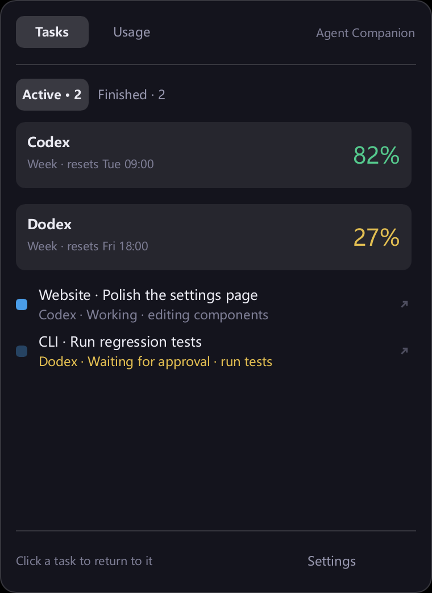
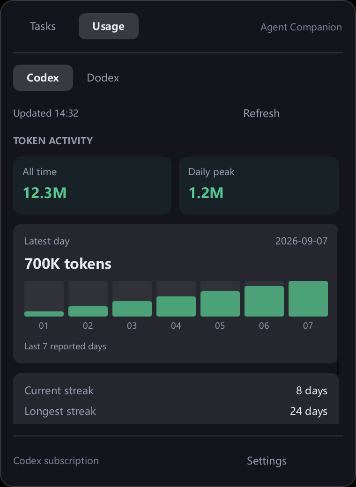
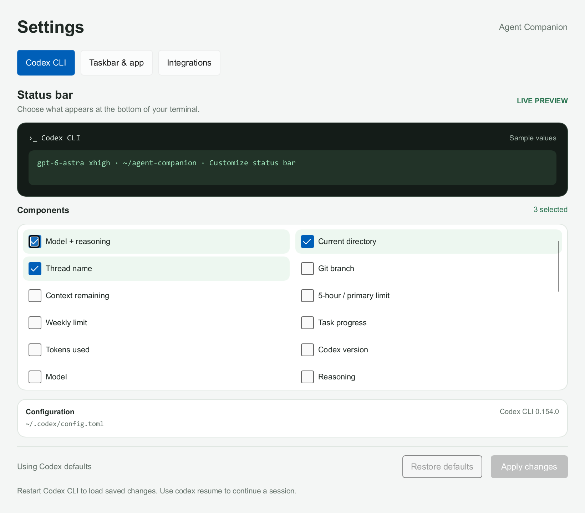
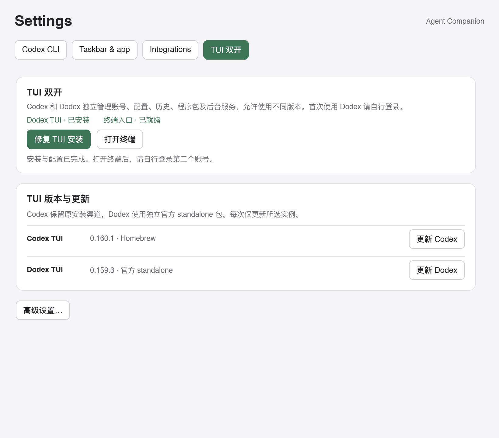
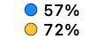
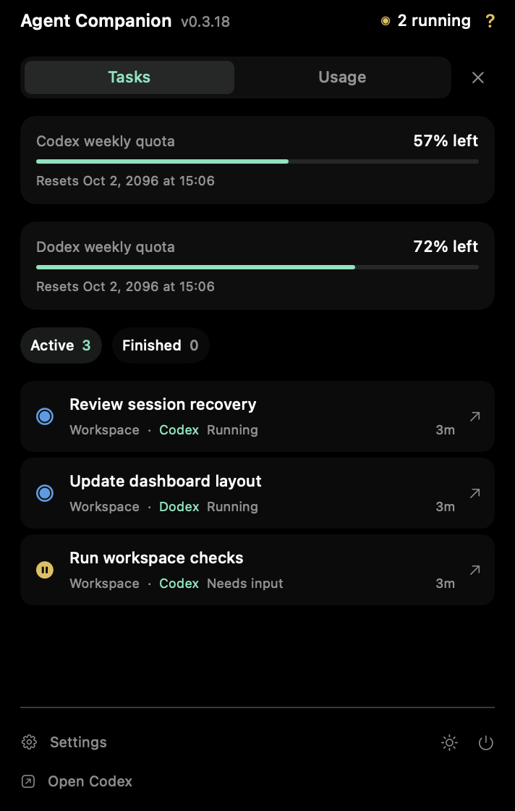
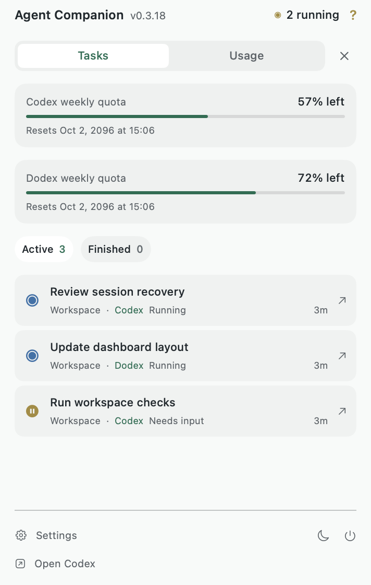
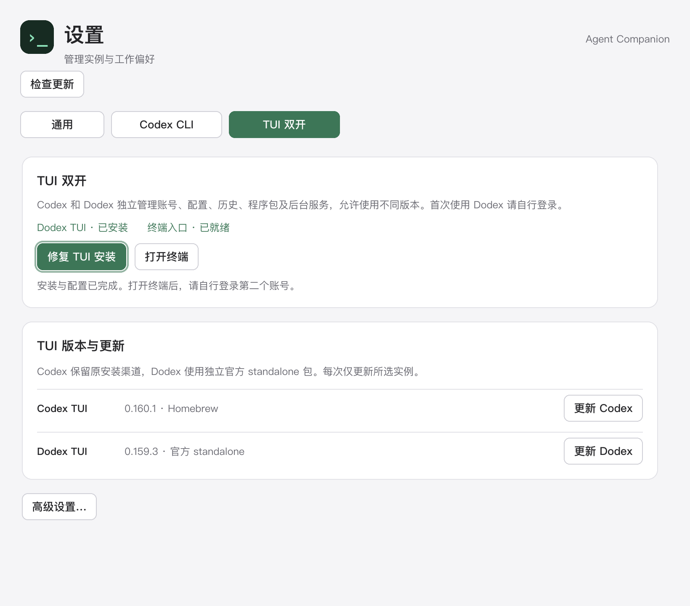

# Agent Companion

[中文](#中文) · [English](#english) · [截图 / Screenshots](#截图--screenshots) · [下载 / Downloads](https://github.com/WXGopher/agent-companion/releases/latest)

## 中文

在 Windows 任务栏或 macOS 菜单栏查看 Codex 的任务状态与订阅用量。

### 主要功能

- **会话接力 CLI**：`acomp resume` 按当前目录搜索 Codex / Dodex 原会话，保留历史和设置，并选择本次使用的额度账号。通过 `agent-companion install-cli` 安装命令；macOS 需要受支持的原生 CLI 与登录方式，Windows 暂不支持恢复启动。详见[接力用法与兼容性](docs/RESUME.md)。
- **更新提示**：主动打开面板时在后台检查 GitHub 正式发布版本，每 24 小时最多检查一次，重启后仍复用本地记录。发现更高版本时显示版本号，点击“查看更新”打开对应 Release 页面。检查不阻塞面板；断网或检查失败时静默保留已有提示，不自动下载或安装。
  设置窗口提供 **检查更新** 按钮，可立即检查最新正式版。按钮下方显示检查进度和结果；发现新版后，点击 **查看 GitHub Release** 打开发布页面。检查失败可重试；不会自动下载、安装或打开浏览器。
- **任务状态**：查看运行中、待处理和已结束的任务，点击返回对应对话或终端。
- **Tasks / Usage**：切换任务与用量，查看剩余额度、重置时间、累计 Token 和最近七个有记录日期的用量柱状图。
- **状态栏定制**：选择 Codex CLI 状态栏组件，实时预览并保存。
- **Windows 集成**：任务栏分别显示 Codex（`C`）和 Dodex（`D`）的每周剩余额度；支持任务完成通知、开机启动，以及可选的工具审批和提问卡片。
- **macOS 入口**：菜单栏显示每周剩余额度，Codex 在上、Dodex 在下；有历史读数的实例在闲置时继续显示，仅最近一次额度查询失败时旧值带 `*`，悬停可查看最后成功时间和失败原因。尚无读数时显示 `—` 和对应任务状态；点击弹出任务／用量面板，设置从面板底部打开。
- **任务状态标记**：分别显示 Codex／Dodex 状态：蓝色呼吸表示进行中，黄色表示待确认／待输入或失败，绿色仅表示所有任务均完成，灰色表示无任务或停止、暂停、未知等状态。混合任务优先显示等待，其次显示运行。macOS 菜单栏与 Windows 任务栏使用相同颜色含义。
- **macOS 面板**：顶部显示 Agent Companion、当前版本和正在运行的任务数。点击底部的太阳／月亮按钮切换亮色／暗色主题，Tasks 和 Usage 同步更新；重启后保留主题选择，默认使用暗色。
- **可选 Codex 双开（Windows / macOS）**：在设置中一键安装并配置 Dodex，App 与 TUI 共用独立副账号，分别对齐本机对应的 Codex 版本。任务标注来源，用量和 CLI 状态栏设置按实例管理；首次使用时自行登录第二个账号。
- **配置与个人指令同步**：双开页签显示双方文件路径，提供独立的 Codex → Dodex、Dodex → Codex 操作，手动覆盖 `config.toml` 或各自 `CODEX_HOME` 下的全局 `AGENTS.md`，覆盖前备份目标。配置可能含有内嵌密钥，同步时会一并复制；**不复制 `auth.json`**，保留目标实例的登录存储、数据库和日志设置。没有自动同步，详见[同步说明](docs/macos-dual-instance.md#manual-configuration-and-instruction-sync)。

订阅用量复用本机 Codex TUI 或 App 已有的 ChatGPT 登录，无需另设 API Key。默认每 5 分钟自动刷新，设置可调整为 1–60 分钟；手动刷新只查询当前实例。额度与历史分别加载，查询不创建模型任务、不消耗推理 Token。Codex 的托管策略继续生效；无法确认账号或配置时显示原因。

界面保留同一账号最后成功的额度读数，查询失败后以 `*` 标注；尚无读数时显示 `—`。换号或登出会清除旧读数，额度重置时间到达后等待下次查询，不推算剩余额度。Usage 显示最后成功时间、失败原因和历史 Token 统计。详见[用量查询行为](docs/USAGE_QUERIES.md)。

**v0.3.29 Windows 修复**：同一数据库目录的普通路径与 Windows 扩展路径不再被误判为不同来源，恢复受影响的 Codex / Dodex 额度查询；保留原有账号隔离核验，无需因这一问题重新登录。

### 安装

**Windows x86_64**

1. 安装 [Microsoft Visual C++ x64 运行库](https://aka.ms/vc14/vc_redist.x64.exe)。
2. 从[最新版本](https://github.com/WXGopher/agent-companion/releases/latest)下载以 `windows-x86_64.zip` 结尾的压缩包，解压后双击 `agent-companion.exe`。
3. 如需工具审批，在解压目录打开 PowerShell，安装 Codex hooks：

```powershell
.\agent-companion.exe setup install codex
```

随后在 Codex 中用 `/hooks` 审阅并信任配置，再开启新会话。如需提问卡片及精确终端跳转，使用同目录的 `agent-companion-codex.exe` 启动 Codex。

**Windows 双开**：右键任务栏读数或托盘图标 → **Settings… → Codex 双开 → 安装并配置 Dodex**。一次完成独立环境、`dodex` 命令和 Companion 接入；监控开关与手动配置同步收在“高级设置”。需要本机已安装且签名有效的官方 Microsoft Store Codex / ChatGPT 应用。启用时先检查已有环境，缺少时自动部署，并配置 shell 的 `dodex` 命令；重复操作会校验环境、补齐命令，不覆盖已有账号和个人配置。在 PowerShell、cmd 或 Git Bash 中运行 `dodex`，会在当前终端和工作目录打开使用第二份配置的 Codex CLI；首次使用时自行登录第二个账号：

```powershell
dodex
dodex --help
dodex resume
dodex exec "检查当前项目"
dodex -C C:\projects\demo
```

普通参数直接传给 Codex CLI，`--help` 和 `--version` 也由 Codex 处理；`dodex app [PATH]` 打开隔离桌面，`dodex update` 进入统一维护流程。以 `--check` 或 `--deploy` 开头时进入环境管理：`dodex --check` 只检查官方运行程序；`dodex --deploy` 部署或校验环境并修复 shell 支持。升级旧版命令时，从新版程序运行 `.\agent-companion.exe dodex --deploy`。独立环境位于 `%LOCALAPPDATA%\AgentCompanion\Dodex`，已有账号、会话和个人配置继续使用。

**开始菜单打开 App，终端打开 CLI**：部署后，在开始菜单搜索 **Dodex** 打开桌面 App；快捷方式指向 `%LOCALAPPDATA%\AgentCompanion\Dodex\dodex.exe`（GUI 启动器，无控制台窗口）。PATH 命令目录中的另一份 `dodex.exe` 专供 PowerShell、cmd 和 Git Bash，运行 `dodex` 仍会打开第二个 profile 的 Codex CLI。两个入口使用同一份第二实例配置。任务栏或托盘菜单的 **打开 Dodex**、`.\agent-companion.exe dodex` 也可打开桌面版。

已有环境从新版程序运行 `.\agent-companion.exe dodex --deploy` 即可补齐或修复开始菜单入口和 CLI 命令，无需重新登录。两个启动器均安装在固定位置，不依赖下载或构建目录。未安装官方 standalone TUI 时，Dodex 使用已验签的桌面包内置 CLI；不会改动现有 npm Codex 命令。版本页会标明 App 内置 CLI，并支持对齐这一来源。独立 TUI 的官方稳定版更新仍需受支持的完整 standalone 包。

本轮已完成 Windows 本机部署、启动与双账号额度查询验证；最终任务栏和面板外观仍待目视验收，详见 [Windows 验证记录](docs/WINDOWS_VALIDATION.md)。

命令优先放入当前 PATH 已包含的用户命令目录，现有终端即可发现；Git Bash 如缓存了旧命令，可运行 `hash -r`。若需要新增 PATH 目录，设置会提示完全退出并重开终端。已有无关的同名命令不会被覆盖，设置会指出冲突路径。

**macOS 14+ · Apple Silicon**

1. 从[最新版本](https://github.com/WXGopher/agent-companion/releases/latest)下载以 `macos-arm64.zip` 结尾的压缩包。
2. 解压，将 `Agent Companion.app` 拖到“应用程序”并打开。

应用尚未经过 Apple 公证；首次打开若被拦截，可按 [Apple 官方说明](https://support.apple.com/102445)在“系统设置 → 隐私与安全性”中选择“仍要打开”。

**macOS 双开**：设置 → Codex 双开 → **安装并配置 Dodex**，一次完成 Dodex App、完整 TUI 安装包、`dodex` 命令与 Companion 接入。App 和 TUI 共用独立副账号目录；不会自动复制主账号登录、个人配置或 AGENTS 指令。安装完成后点击“打开 Dodex”，自行登录第二个账号，也可在终端运行 `dodex`。页面显示各步骤进度；部分失败时保留已完成内容，修正原因后点击“继续安装并配置”。相同流程也可运行 `agent-companion dodex-app --install`。App 来源须为本机签名有效的官方 `Codex.app` 或保留 Codex 身份的 `ChatGPT.app`；TUI 来源须为受支持的官方完整 standalone 安装。[双开说明](docs/macos-dual-instance.md)

**macOS 版本对齐**：打开双开设置即自动比较本机版本，显示是否一致、可对齐或较新；缺少 Dodex 时明确提示安装。同页点击 **对齐版本**，Dodex App 对齐本机 Codex App，Dodex TUI 对齐本机 Codex TUI；两者版本可以不同，不联网、不自动降级较新的 Dodex。只需退出待替换的 Dodex App / TUI，读取来源的 Codex 可以继续运行。四项当前／目标版本、进度和部分失败结果会分别显示。“高级设置”保留监控开关、手动 config/AGENTS 同步和 **全部更新到最新**；后者会联网检查官方稳定版并更新主程序。安装、对齐均保留副账号登录与会话，不自动结束或重启进程。[维护细节](docs/macos-dual-instance.md#explicit-version-maintenance)

macOS 从菜单栏打开任务／用量面板，设置位于面板底部；重新打开 Agent Companion 会显示 Tasks 页。详见[菜单栏说明](docs/MACOS_MENU_BAR.md)。

**macOS 开机自动启动**：设置 → 通用 → 登录时自动启动。开启后在当前用户登录此 Mac 时启动菜单栏应用；关闭不退出当前应用。开关读取 macOS 实际登录项状态；如需系统批准或操作失败，会显示原因，并提供“系统登录项设置”入口。额度自动刷新间隔也在“通用”页。

**双开隔离与停用**：两个平台的新环境均使用独立文件凭证、历史、数据库和个人配置，不复制原实例的账号数据。已有环境只有通过兼容性和隔离校验才会接入，冲突时停止且不覆盖。停用只关闭 Companion 对第二实例的监控，不退出 Dodex、不删除环境。macOS Dodex App 在启动时同步本机官方应用；两平台的成对维护均须明确发起；Windows 桌面通过精确 Store 产品 ID 调用 WinGet，重新定位和验签后同步 Dodex，TUI 独立维护完整包。暂不提供卸载功能。

**升级**：先退出旧程序及设置窗口，再替换文件；已安装 Windows hooks 的用户需重新执行安装命令。Codex 配置、账号和双开环境会保留。

## English

See Codex tasks and subscription usage in the Windows taskbar or macOS menu bar.

### Features

- **Session handoff CLI**: `acomp resume` finds original Codex / Dodex sessions in the current directory, preserves history and settings, and lets you choose the quota account for this run. Install commands with `agent-companion install-cli`. macOS requires a supported native CLI and login method; Windows resume launch is not supported. See [resume usage and compatibility](docs/RESUME.md).
- **Update notifications**: opening the panel checks for a newer stable GitHub release in the background, at most once every 24 hours across restarts. Updates link to their release page; the app does not download or install them automatically.
  Use **检查更新** (Check for updates) in Settings to check the latest stable release immediately. Progress and results appear below the button. When a newer version is available, select **查看 GitHub Release** to open its release page. Failed checks can be retried; checking never automatically downloads, installs, or opens the browser.
- **Tasks**: track running, waiting and finished tasks, then jump back to the conversation or terminal.
- **Tasks / Usage**: switch to remaining quota, reset times, lifetime tokens and a bar chart of the last seven reported days.
- **Status bar editor**: choose Codex CLI components with a live preview.
- **Windows integration**: separate taskbar readings for Codex (`C`) and Dodex (`D`) weekly quota remaining, completion notifications, startup settings, and optional tool approvals and question cards.
- **macOS menu bar**: the menu bar shows weekly quota remaining, with Codex above Dodex. Instances with a previous reading stay visible while idle; the previous value carries `*` only after a failed quota query, with the last success time and error on hover. Before a reading is available, its row shows `—` and the task status; click it for tasks and usage. The menu bar is the only macOS entry; open Settings from the popup footer.
- **Task status marks**: Codex / Dodex each show breathing blue for running tasks, yellow for approval/input or failure, green only when every task completed, and gray for no tasks, stopped, paused or unknown states. Waiting takes priority over running in mixed groups. The macOS menu bar and Windows taskbar use the same color meanings.
- **macOS panel**: the header shows Agent Companion, its current version and the number of running tasks. Use the sun / moon button at the bottom to switch light / dark themes across Tasks and Usage. Your theme choice is saved across restarts; dark is the default.
- **Optional second Codex instance (Windows / macOS)**: install and configure Dodex in one action in Settings. App and TUI share an independent secondary account and align with their corresponding local Codex versions. Tasks show their source; usage and CLI status bar settings stay separate. Sign in with the second account on first use.
- **Configuration and personal instructions**: the dual-instance tab shows both file paths and separate Codex → Dodex / Dodex → Codex actions for manually overwriting `config.toml` or the global `AGENTS.md` in each `CODEX_HOME`, with destination backups. Config files may contain embedded secrets, which are copied; **`auth.json` is never copied**, and the destination's account storage, database and log settings remain independent. Sync is never automatic. See [sync behavior](docs/macos-dual-instance.md#manual-configuration-and-instruction-sync).

Subscription usage reuses the existing ChatGPT login from your local Codex TUI or App, with no separate API key. Automatic refresh defaults to five minutes and can be set to 1–60 minutes; manual refresh queries only the selected instance. Quota and history load independently. Queries do not create model tasks or spend inference tokens. Codex's managed policies still apply, and unverifiable accounts or configurations show a reason.

The interface retains the last successful quota reading for the same account, marking it with `*` after a failed query and showing `—` before a reading is available. Switching accounts or signing out clears old readings. After a quota reset time, the app waits for the next query instead of estimating the remaining allowance. Usage shows the last success time, failure reason and historical token totals. See [usage query behavior](docs/USAGE_QUERIES.md).

**v0.3.29 Windows fix:** ordinary and extended Windows paths to the same database directory are no longer treated as different sources, restoring affected Codex / Dodex quota queries. Account-isolation checks remain in place; this issue does not require signing in again.

### Install

**Windows x86_64**

1. Install the [Microsoft Visual C++ x64 Redistributable](https://aka.ms/vc14/vc_redist.x64.exe).
2. Download the archive ending in `windows-x86_64.zip` from the [latest release](https://github.com/WXGopher/agent-companion/releases/latest), extract it, and open `agent-companion.exe`.
3. For tool approvals, open PowerShell in the extracted folder and install Codex hooks:

```powershell
.\agent-companion.exe setup install codex
```

Use `/hooks` in Codex to review and trust the configuration, then start a new session. For question cards and precise terminal navigation, launch Codex through `agent-companion-codex.exe` in the same folder.

**Windows second instance**: right-click the taskbar readout or tray icon → **Settings… → Codex 双开 → 安装并配置 Dodex**. One action prepares the independent environment, `dodex` command and Companion monitoring. The monitoring switch and manual file synchronization are under advanced settings. Requires the locally installed, validly signed official Microsoft Store Codex / ChatGPT app. Enabling checks an existing environment, deploys one if missing, and registers the `dodex` shell command. Repeating this validates the deployment and repairs shell support without overwriting existing account data or personal settings. In PowerShell, cmd or Git Bash, `dodex` opens Codex CLI in the current terminal and working directory using the second profile. Sign in with a second account on first use:

```powershell
dodex
dodex --help
dodex resume
dodex exec "Inspect this project"
dodex -C C:\projects\demo
```

Regular arguments pass directly to Codex CLI, including `--help` and `--version`. `dodex app [PATH]` opens the isolated desktop; `dodex update` enters paired maintenance. A leading `--check` or `--deploy` selects deployment management: `dodex --check` checks the official runtime; `dodex --deploy` deploys or validates the environment and repairs shell support. To upgrade an older command, run `.\agent-companion.exe dodex --deploy` from the new release. The isolated environment lives under `%LOCALAPPDATA%\AgentCompanion\Dodex`; existing account data, sessions and personal settings stay in use.

**Start menu opens the app; terminals open the CLI.** After deployment, search for **Dodex** in Start to open the desktop app. Its shortcut targets `%LOCALAPPDATA%\AgentCompanion\Dodex\dodex.exe`, a GUI launcher with no console window. The separate `dodex.exe` in the PATH command directory remains a console launcher: `dodex` in PowerShell, cmd or Git Bash starts Codex CLI with the second profile. Both entry points share that second-instance profile. **打开 Dodex** in the taskbar or tray menu and `.\agent-companion.exe dodex` also open the desktop app.

For an existing environment, run `.\agent-companion.exe dodex --deploy` from the new build to add or repair the Start menu entry and CLI command without signing in again. Both launchers are installed in stable locations and do not depend on the download or build directory. When the official standalone TUI is absent, Dodex uses the verified desktop package's bundled CLI and leaves an existing npm Codex command unchanged. The version panel labels the app-bundled CLI and supports alignment from this source. Updating a standalone TUI from the official stable channel still requires a supported complete standalone package.

Local Windows deployment, startup and both accounts' quota queries have been verified for this update. The final taskbar and panel appearance still need a visual check; see the [Windows validation record](docs/WINDOWS_VALIDATION.md).

The command is installed in a supported user command directory already on the current PATH when possible, so existing terminals can find it. Run `hash -r` in Git Bash if it cached an older command. If a new PATH entry is needed, Settings asks you to fully quit and reopen the terminal. Unrelated commands with the same name are preserved, and Settings reports the conflicting path.

**macOS 14+ · Apple Silicon**

1. Download the archive ending in `macos-arm64.zip` from the [latest release](https://github.com/WXGopher/agent-companion/releases/latest).
2. Extract it, drag `Agent Companion.app` into Applications, and open it.

The app is not Apple-notarized. If the first launch is blocked, follow [Apple's instructions](https://support.apple.com/102445) to choose **Open Anyway** in System Settings → Privacy & Security.

**macOS second instance**: Settings → Codex 双开 → **安装并配置 Dodex** installs the App and complete TUI package, configures `dodex`, and enables Companion monitoring in one action. App and TUI share an independent secondary profile; primary credentials, personal settings and AGENTS instructions are not copied. After setup, click **打开 Dodex** and sign in with the second account yourself, or run `dodex` in a terminal. Progress and partial failures remain visible; completed steps are preserved when retrying. `agent-companion dodex-app --install` runs the same workflow. Sources must be a locally installed, validly signed official Codex App and a supported complete standalone Codex TUI package. [Dual-instance guide](docs/macos-dual-instance.md)

**macOS version maintenance**: opening dual-instance settings automatically compares local versions, showing whether Dodex matches, can be aligned or is newer. Missing Dodex installations show an install prompt. Click **对齐版本** on the same page to align each Dodex App/TUI with its corresponding local Codex App/TUI; their version numbers can differ. Alignment is offline and preserves a newer Dodex. Close the Dodex processes being replaced; the source Codex can keep running. Four rows report current/target versions, progress and partial results. Advanced settings retain monitoring, manual config/AGENTS synchronization and **全部更新到最新**, which contacts official stable-release services and updates the primary installation. Account data and sessions are preserved; processes are never terminated or restarted automatically. [Maintenance details](docs/macos-dual-instance.md#explicit-version-maintenance)

On macOS, open tasks and usage from the menu bar, with Settings in the popup footer. Reopening Agent Companion shows the Tasks page. See the [menu-bar guide](docs/MACOS_MENU_BAR.md).

**macOS launch at login**: Settings → 通用 → 登录时自动启动 starts the menu-bar app when the current user logs in. Disabling it leaves the running app open. The switch reads the actual macOS login-item status; pending approval and failures remain visible with a link to System Settings. The quota refresh interval also lives in 通用.

**Isolation and disabling**: on both platforms, a fresh environment has separate file credentials, history, databases and personal settings, without copying account data from the original instance. Existing environments are adopted only after compatibility and isolation checks; conflicts stop without overwriting. Disabling integration stops Companion monitoring the second instance without quitting Dodex or deleting its environment. macOS Dodex App syncs from the local official App at startup; paired maintenance requires an explicit action on both platforms. Windows uses the exact Store product ID with WinGet, rediscovers and verifies the desktop signature before synchronizing Dodex, and maintains the complete TUI package separately. Uninstall is not included.

**Upgrade**: quit the old app and its Settings window, then replace the files. If you installed Windows hooks, rerun the installation command. Codex configuration, accounts and the second-instance environment are retained.

## 截图 / Screenshots

界面使用演示数据。 / Screenshots use sample data.

### Windows

<p align="center">
  
  
</p>

<details>
<summary>设置 / Settings</summary>

<p align="center"></p>

<p align="center"></p>

</details>

### macOS

<p align="center"></p>
<p align="center">
  
  
</p>

<details>
<summary>设置 / Settings</summary>

<p align="center"></p>

</details>

---

[GPL-3.0-only](LICENSE) · [Third-party notices](THIRD_PARTY_NOTICES.md)
